# Windows安装

## 下载

社区版本`MySQL Community Server`开源免费：<https://dev.mysql.com/downloads/mysql/>

## 安装

### 步骤1

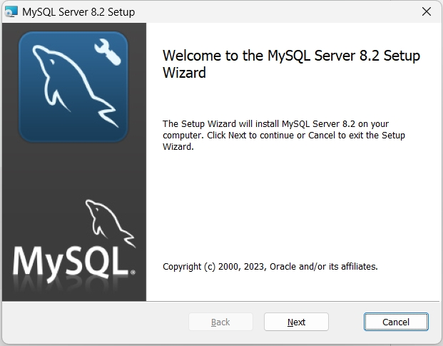

### 步骤2

- `Typical`：默认安装
- `Custom`：自定义安装路径
- `Complete`：安装所有功能

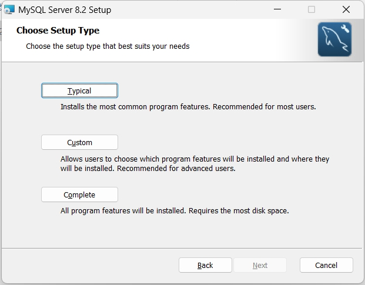

### 步骤3

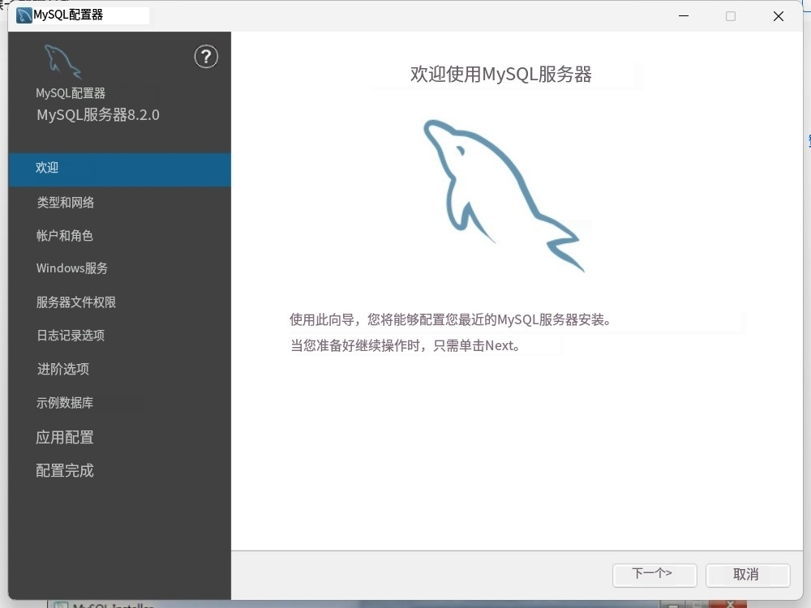

### 步骤4

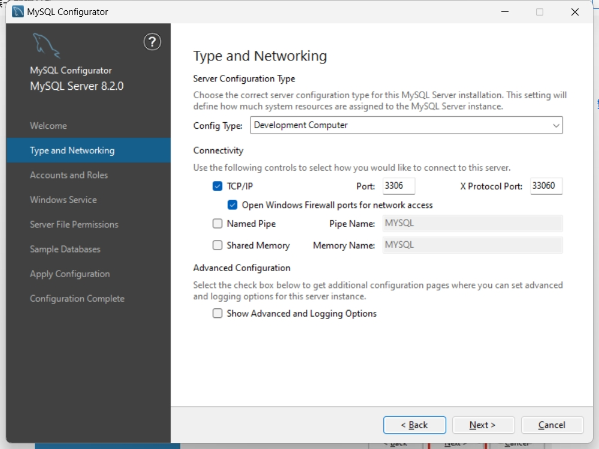

### 步骤5

设置`root`密码
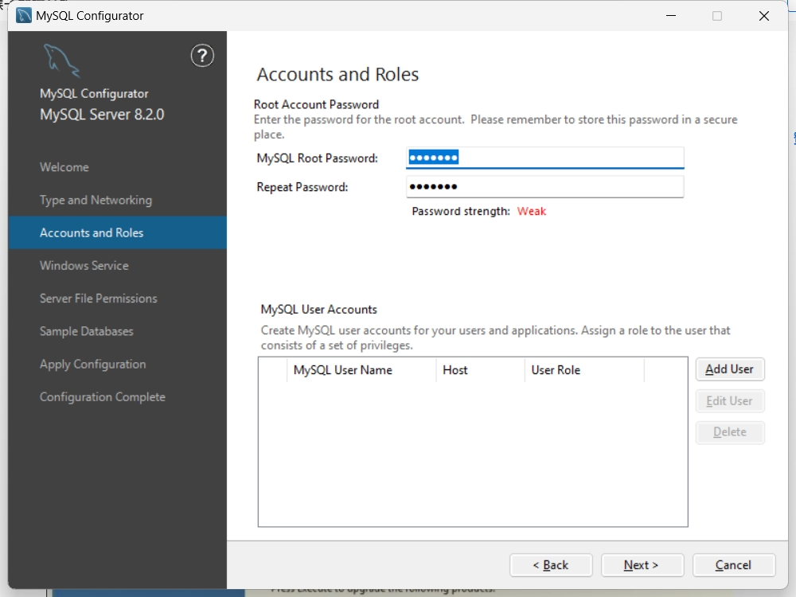

### 步骤6

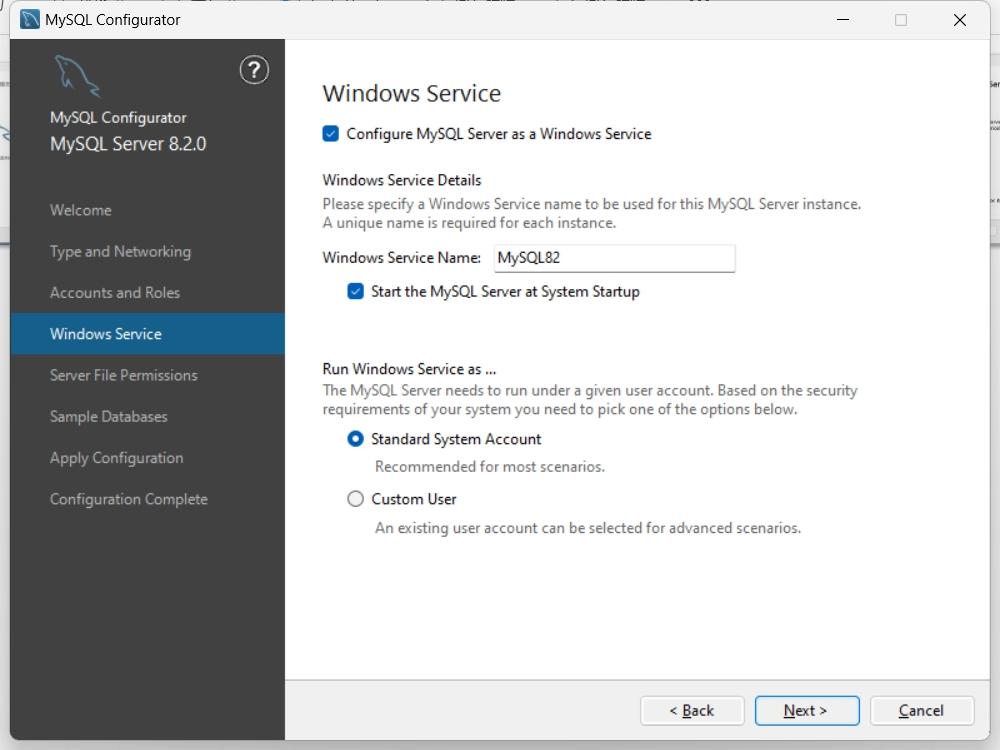

### 步骤7

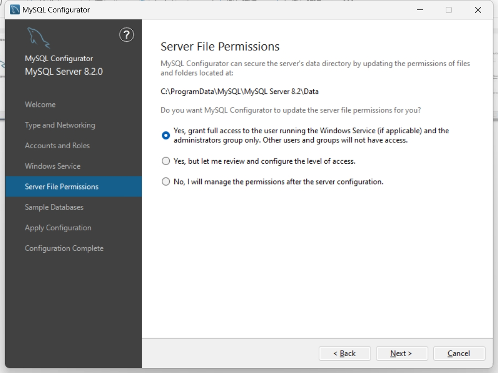

### 步骤8

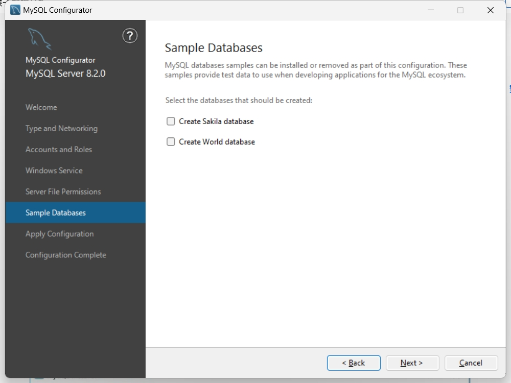

### 步骤9

点击`execute`
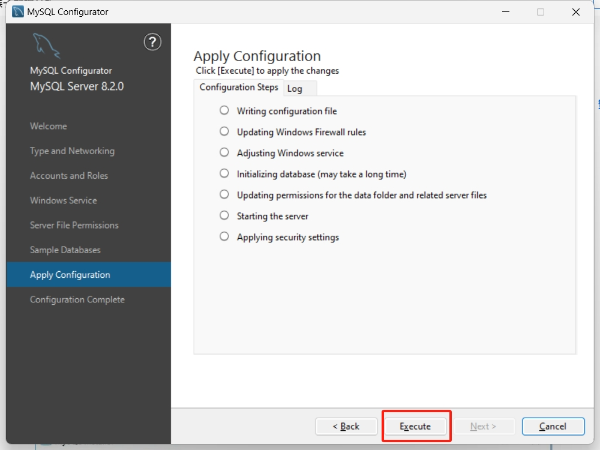

### 步骤10

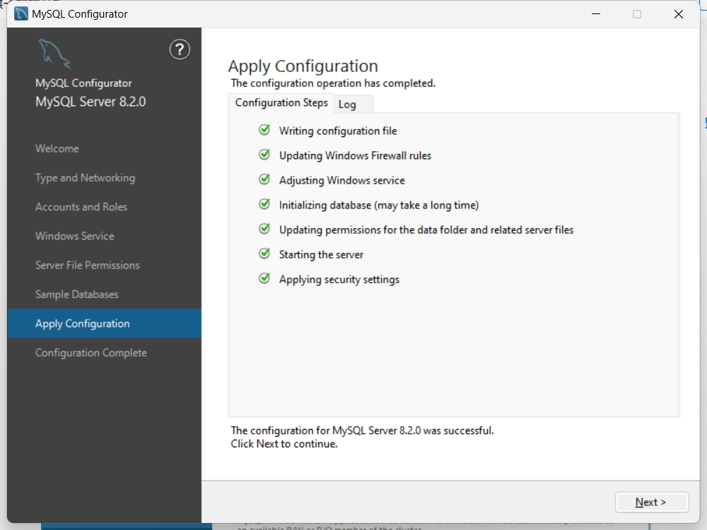

### 完成安装

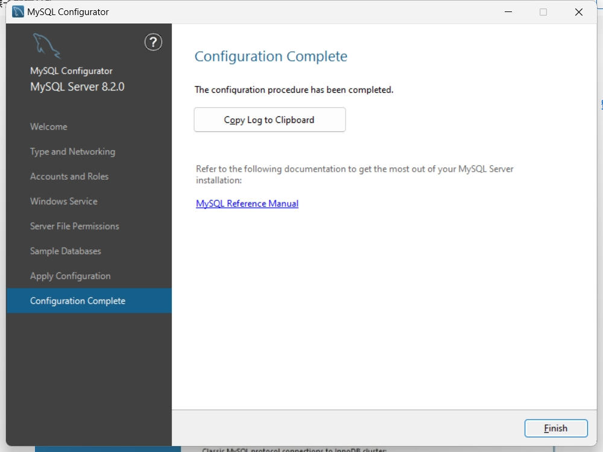

### 检查是否安装成功

> 默认安装路径： C:\Program Files\MySQL\MySQL Server 8.2\bin

在安装数据库的目录下打开`cmd`,输入：`./mysql -u root -p`输入密码后看到下图提示则安装成功。
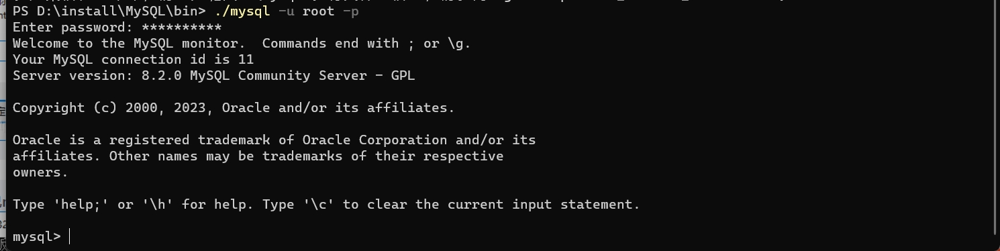

### 配置环境变量

- 将安装`MySQL`目录路径到`bin`路径添加到环境变量中。
- 在`path`中添加`MySQL`安装路径即可。

## 卸载

使用：`geek`卸载即可，自动清理注册表文件。
